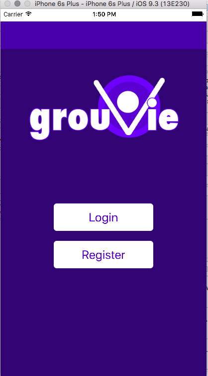
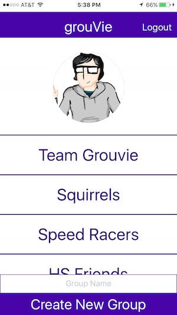
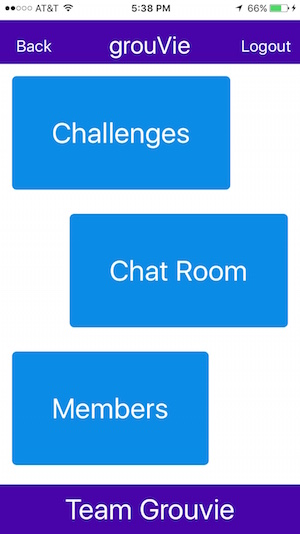
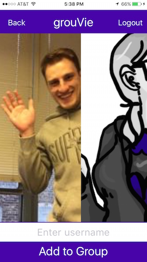
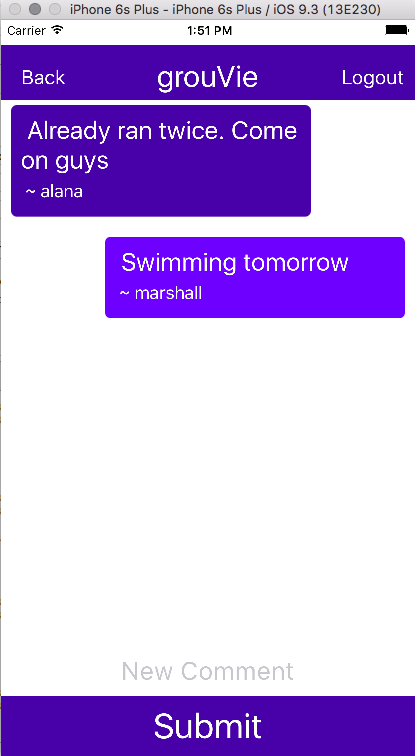
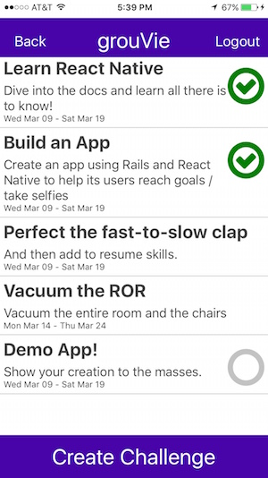
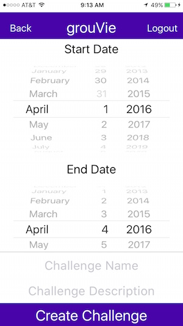
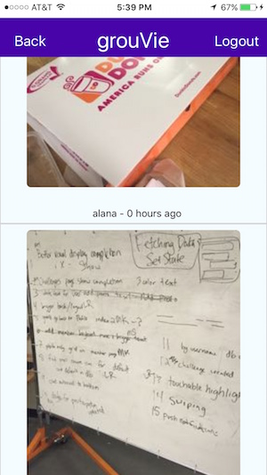
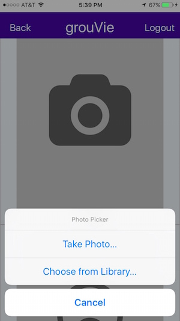

# grouVie-react

##Description
grouVie is a mobile app built with React Native and Ruby on Rails in 8 days as a final project at Dev Bootcamp Chicago. The app allows users to create groups of like-minded friends and to post challenges within the group. If other members accept that challenge, they can announce its completion by posting a selfie using the in-app camera function. The app also features in-group instant messaging.

This respository houses the front-end mobile application - for the API, see [grouVie](https://github.com/msosland/grouVie). To check out the app, open ios/GrouVieReact.xcodeproj in XCode. Your version of XCode must be 7.0 or higher.

##Contributors

* [Alana Hanson](https://github.com/alanahanson)
* [Michal Klimek](https://github.com/KlimekM)
* [Lauren Reid](https://github.com/tomorrow-lauren)
* [Marshall Sosland](https://github.com/msosland)

##Screenshots

Here is the profile page for a user. Users can set their image, see their list of groups, and add new groups.

Inside each group is a group landing page menu. Users can see groups challenges, chat, or members.

The members page allows the user to swipe through all the people in the group.

The chat page allows the user to chat about the challenges or anything they want!

The challenge page shows the group's challenges. Green is for challenges that have been completed, gray is for incomplete, and blank means that the user is not participating in that challenge.

Users can add new challenges with start and end dates.

For each challenge, users can scroll through the photos that their friends uploaded.

Users can select to take a picture of upload a photo when they complete a challenge.

