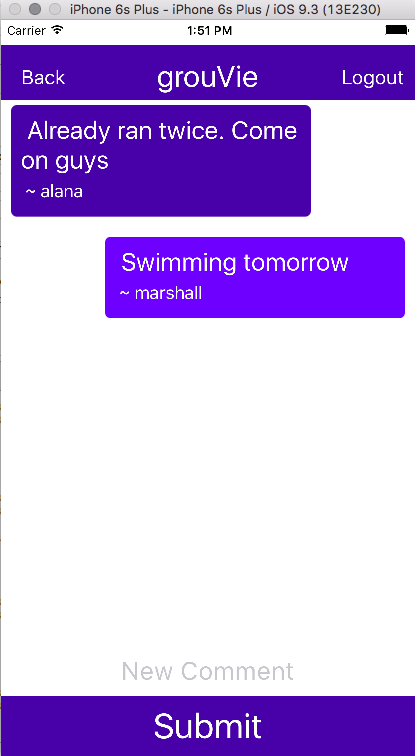
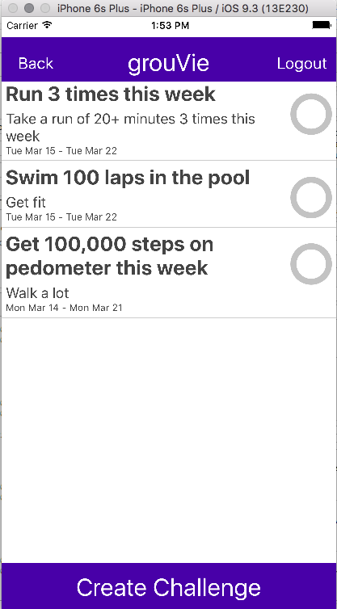

# grouVie-react

##Description
grouVie is a mobile app built with React Native and Ruby on Rails in 8 days as a final project at Dev Bootcamp Chicago. The app allows users to create groups of like-minded friends and to post challenges within the group. If other members accept that challenge, they can announce its completion by posting a selfie using the in-app camera function. The app also features in-group instant messaging.

This respository houses the front-end mobile application - for the API, see [grouVie](https://github.com/msosland/grouVie). To check out the app, open ios/GrouVieReact.xcodeproj in XCode. Your version of XCode must be 7.0 or higher.

##Contributors

* [Alana Hanson](https://github.com/alanahanson)
* [Michal Klimek](https://github.com/KlimekM)
* [Lauren Reid](https://github.com/tomorrow-lauren)
* [Marshall Sosland](https://github.com/msosland)

##Screenshots

